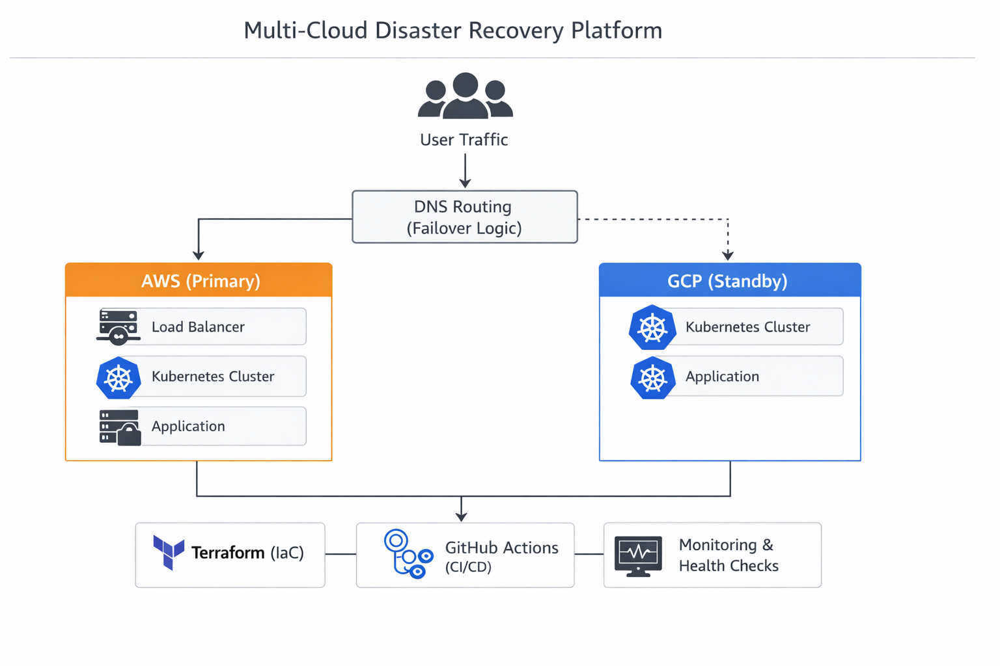

# Multi-Cloud Disaster Recovery Platform

**Production-grade multi-cloud disaster recovery platform designed for automated failover, infrastructure consistency, and reliability engineering aligned to strict RTO/RPO objectives.**

---

## 🔥 Why This Project Matters

This project demonstrates how to design and operate a **resilient cloud platform**, not just deploy infrastructure.

It focuses on:
- Reliability engineering (RTO/RPO-driven design)  
- Automated failure detection and recovery  
- Infrastructure portability across cloud providers  
- Production-style system design tradeoffs (cost vs availability)  

---

## 🏗️ Architecture Overview

- **Primary Cloud:** AWS  
- **Standby Cloud:** Google Cloud Platform  
- **Orchestration:** Kubernetes  
- **Infrastructure Provisioning:** Terraform  
- **CI/CD:** GitHub Actions  

### Key Design Decisions

- Active-passive architecture aligned to business recovery objectives  
- Kubernetes ensures workload portability across cloud providers  
- Terraform enables consistent, repeatable infrastructure deployments  
- Health-check driven failover reduces downtime and manual intervention  

---

## 🧭 Architecture Diagram

---

## 🚀 Production Readiness Improvement: Failover Optimization

### 🧠 Problem

Initial failover time was approximately **2–3 minutes**, which is unacceptable for user-facing production systems.

---

### 🔍 Root Cause Analysis

Failover delay was caused by a combination of:

- **DNS TTL caching** delaying traffic redirection  
- **Health check detection latency (~90 seconds)**  
- **Cold standby environment startup time**  

---

### 🏗️ Architecture Evolution

**Before (Baseline Design)**  
