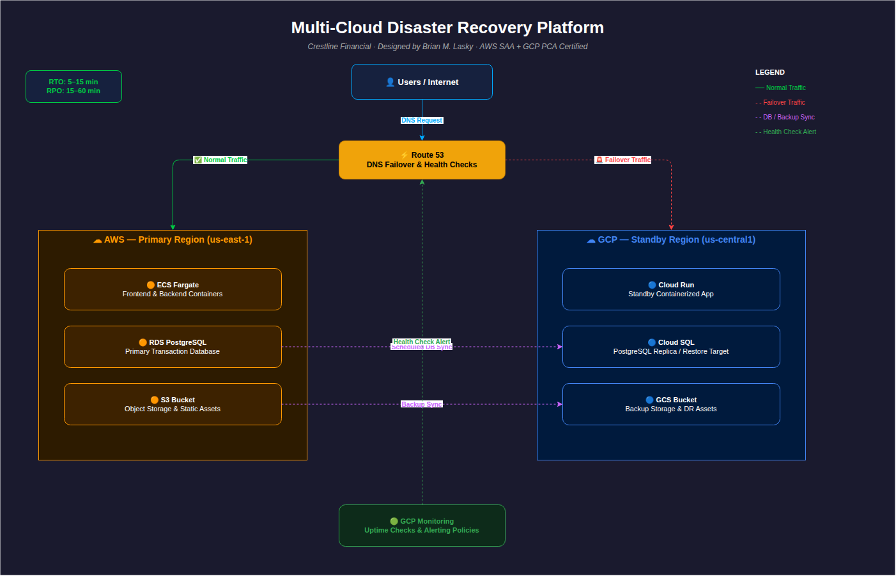

# Multi-Cloud Disaster Recovery Platform


Production-style portfolio project demonstrating a compliance-aware disaster recovery architecture across **AWS** and **Google Cloud** using **Terraform**, **Kubernetes**, **Docker**, and **GitHub Actions**.

## Table of Contents

* [Overview](#overview)
* [Business Scenario](#business-scenario)
* [Architecture Summary](#architecture-summary)
* [Target Recovery Objectives](#target-recovery-objectives)
* [High-Level Design](#high-level-design)
* [What This Project Demonstrates](#what-this-project-demonstrates)
* [Architecture Diagram](#architecture-diagram)
* [Repository Structure](#repository-structure)
* [Tooling](#tooling)
* [Example Workflow](#example-workflow)
* [Tradeoffs and Design Decisions](#tradeoffs-and-design-decisions)
* [What I Would Improve Next](#what-i-would-improve-next)
* [How to Use This Repo](#how-to-use-this-repo)
* [Resume-Aligned Highlights](#resume-aligned-highlights)
* [Why This Project Matters](#why-this-project-matters)
* [About Me](#about-me)
* [Contact](#contact)

## Key Files

* [`docs/architecture-diagram.png`](./docs/architecture-diagram.png) — high-level architecture diagram
* [`docs/disaster-recovery-runbook.md`](./docs/disaster-recovery-runbook.md) — disaster recovery procedure and operational steps
* [`infrastructure/`](./infrastructure/) — infrastructure as code, environment definitions, and cloud resources
* [`.github/workflows/`](./.github/workflows/) — CI/CD automation and validation workflows
* [`app/`](./app/) — demo application source code

## Recruiter Quick Scan

**Role alignment:** Cloud / DevOps Engineer, Cloud Infrastructure Engineer, SRE-adjacent roles
**Primary skills shown:** Terraform, Kubernetes, Docker, GitHub Actions, AWS, GCP
**Core scenario:** Multi-cloud disaster recovery for a compliance-sensitive payment platform
**Key engineering themes:** infrastructure as code, failover planning, CI/CD, security checks, reliability, operational discipline

## Overview

This project simulates a payment-processing platform that must remain available during regional or platform-level disruption. The design uses **AWS as the primary environment** and **GCP as the standby environment**, with infrastructure defined as code, containerized workloads, CI/CD automation, and documented recovery objectives.

It was built to showcase the kind of engineering decisions expected in **Cloud / DevOps Engineer**, **Cloud Infrastructure**, and **SRE-adjacent** roles:

* infrastructure as code across multiple cloud providers
* disaster recovery planning with explicit **RTO/RPO** targets
* containerized application deployment
* CI/CD validation and security checks
* reliability, failover, and operational discipline
* compliance-aware design for a regulated business context

## Business Scenario

A fictional payment-processing company needs a disaster recovery strategy for a customer-facing application handling sensitive transaction workflows. The platform must support high availability, controlled recovery, and auditable infrastructure changes.

### Project Goals

* Demonstrate multi-cloud disaster recovery architecture
* Provision infrastructure reproducibly with Terraform
* Deploy containerized workloads across AWS and GCP
* Automate validation and security checks in CI/CD
* Document practical tradeoffs in reliability, cost, and complexity

## Executive Summary

This project was built to demonstrate that I can do more than deploy cloud services. It shows how I think about availability, recovery, repeatability, and risk in a business context. The architecture uses AWS as the primary environment and GCP as the standby environment, with Terraform for infrastructure provisioning, Kubernetes for orchestration, Docker for packaging, and GitHub Actions for CI/CD and validation.

From a hiring perspective, this repo is meant to show hands-on cloud engineering ability, practical disaster recovery thinking, and the ability to explain technical tradeoffs clearly.

## Architecture Summary

* **Primary environment:** AWS
* **Standby environment:** GCP
* **Infrastructure provisioning:** Terraform
* **Containers:** Docker
* **Orchestration:** Kubernetes
* **CI/CD:** GitHub Actions
* **Security scanning:** Trivy, tfsec, Checkov
* **Traffic / failover layer:** DNS-based failover and health-driven recovery workflow

## Target Recovery Objectives

* **RTO:** 5–15 minutes
* **RPO:** 15–60 minutes

These targets reflect a portfolio project design goal rather than a production SLA.

## High-Level Design

### AWS Primary

* Application workloads hosted in AWS
* Primary database and core runtime services
* Monitoring and health validation for steady-state production traffic

### GCP Standby

* Standby application environment prepared for recovery events
* Secondary service deployment path for failover testing and recovery validation
* Infrastructure aligned closely enough to support controlled recovery procedures

### CI/CD and Security

Each commit triggers automated checks through GitHub Actions, including:

* infrastructure validation
* security scanning
* container scanning
* policy and configuration review

This helps catch issues early and supports repeatable deployment workflows.

## What This Project Demonstrates

### 1. Multi-Cloud Infrastructure as Code

The environment is provisioned using Terraform to show repeatable, version-controlled infrastructure management across providers.

### 2. Disaster Recovery Thinking

The project is built around recovery planning, not just deployment. It includes clear recovery objectives and an architecture intentionally designed for failover scenarios.

### 3. Container and Platform Skills

The workloads are containerized with Docker and deployed into Kubernetes-based environments, demonstrating skills that map well to modern cloud operations.

### 4. CI/CD Discipline

GitHub Actions is used to automate validation and security checks, reinforcing an engineering workflow built around consistency and fast feedback.

### 5. Compliance-Aware Design

The fictional use case is intentionally framed around a regulated environment so the project can demonstrate how cloud design decisions are influenced by security, documentation, and recovery requirements.

## Architecture Diagram



A high-level view of the AWS primary environment, GCP standby environment, failover flow, and supporting CI/CD and recovery components.

## Repository Structure

```text
.
├── .github/
│   └── workflows/
├── app/
├── docs/
│   ├── architecture-diagram.png
│   ├── architecture-diagram.drawio
│   └── disaster-recovery-runbook.md
├── infrastructure/
├── scripts/
├── .gitignore
└── README.md
```

This structure reflects the current repository layout shown on GitHub. You can expand it later if you want to document important subfolders inside `infrastructure/` or `docs/`.

## Tooling

* **Cloud Platforms:** AWS, Google Cloud
* **IaC:** Terraform
* **Containers / Orchestration:** Docker, Kubernetes
* **Automation:** GitHub Actions
* **Security:** Trivy, tfsec, Checkov

## Example Workflow

1. Define infrastructure changes in Terraform
2. Commit changes to GitHub
3. Run GitHub Actions validation and security scanning
4. Deploy or update workloads
5. Validate health and recovery readiness
6. Simulate or document failover procedure

## Demo Walkthrough

This is the story I would use to walk a recruiter, hiring manager, or interviewer through the project in a few minutes.

### 1. Deploy the Primary Environment

* Provision the AWS primary environment using Terraform
* Deploy the application and supporting services
* Confirm the application is reachable and healthy

### 2. Prepare the Standby Environment

* Provision the GCP standby environment using Terraform
* Validate that standby services are configured and ready for recovery use
* Confirm infrastructure parity for core recovery components

### 3. Run CI/CD Validation

* Trigger GitHub Actions workflows on commit
* Run Terraform validation, security checks, and container scanning
* Review results before promoting changes

### 4. Verify Steady-State Health

* Confirm application health in the primary environment
* Review logs, health checks, and deployment readiness
* Validate that recovery documentation and runbook steps are current

### 5. Simulate a Recovery Scenario

* Assume a disruption in the AWS primary environment
* Follow the disaster recovery runbook
* Shift traffic and recovery operations toward the GCP standby environment

### 6. Validate Recovery Outcome

* Confirm application availability after failover
* Compare the result against the documented RTO/RPO targets
* Record lessons learned and opportunities to improve automation

## Tradeoffs and Design Decisions

| Decision                              | Why Chosen                                                                        | Tradeoff                                                                       |
| ------------------------------------- | --------------------------------------------------------------------------------- | ------------------------------------------------------------------------------ |
| Multi-cloud primary/standby design    | Demonstrates recovery planning beyond a single provider failure domain            | Increases architecture complexity and operational overhead                     |
| Terraform for provisioning            | Enables repeatable, version-controlled infrastructure across AWS and GCP          | Requires more up-front structure and provider configuration                    |
| Kubernetes for orchestration          | Shows container orchestration, portability, and modern platform operations skills | Adds learning curve and operational complexity compared with simpler platforms |
| GitHub Actions for CI/CD              | Keeps automation visible, repo-centric, and easy for reviewers to understand      | Less feature-rich than some enterprise CI/CD platforms                         |
| Compliance-sensitive payment scenario | Makes architecture decisions more realistic and business-driven                   | Raises the expectation that design choices be clearly justified and documented |
| Documented RTO/RPO targets            | Shows recovery planning discipline and measurable engineering goals               | Targets are design goals unless backed by repeated testing evidence            |

### Why Multi-Cloud?

A multi-cloud pattern adds cost and complexity, but it is useful here because the goal is to demonstrate recovery planning beyond a single provider failure domain.

### Why Terraform?

Terraform provides a consistent way to model infrastructure across AWS and GCP, making it a strong fit for a portfolio project centered on repeatability and change control.

### Why Kubernetes?

Kubernetes helps demonstrate container orchestration, workload portability, and operational patterns that are relevant to modern platform and SRE-oriented roles.

### Why GitHub Actions?

GitHub Actions keeps the CI/CD story simple, visible, and tightly integrated with the repository. It also makes the validation pipeline easy for recruiters and hiring managers to review.

## What I Would Improve Next

If this were extended further, the next improvements would be:

* more robust observability and alerting
* automated recovery testing
* deeper secrets management integration
* stronger environment parity and rollback workflows
* cost comparison between recovery strategies

## How to Use This Repo

### Prerequisites

* AWS account
* Google Cloud account
* Terraform installed
* Docker installed
* kubectl configured
* access to any required cloud credentials and project/account setup

### Basic Setup

```bash
# Clone the repository
git clone https://github.com/brianmlasky-dev/multi-cloud-dr-platform.git
cd multi-cloud-dr-platform

# Review Terraform configuration
# Initialize Terraform in the relevant directory
terraform init

# Review the execution plan
terraform plan

# Apply infrastructure changes
terraform apply
```

Add provider-specific setup steps, environment variables, and deployment commands based on your actual repo.

## Business Impact Framing

* Reduces manual recovery risk through infrastructure as code and documented procedures
* Improves change consistency through CI/CD validation and security scanning
* Demonstrates recovery planning beyond a single cloud failure domain
* Connects infrastructure decisions to uptime, recovery, and compliance concerns

## Resume-Aligned Highlights

* Built a production-style multi-cloud disaster recovery platform across AWS and GCP
* Provisioned cloud infrastructure using Terraform
* Used Docker and Kubernetes for containerized workload deployment
* Implemented GitHub Actions pipelines with Trivy, tfsec, and Checkov
* Designed around documented RTO/RPO recovery targets in a compliance-sensitive use case

## Why This Project Matters

This project is designed to show more than tool familiarity. It demonstrates the ability to think through:

* availability and recovery requirements
* cloud tradeoffs across platforms
* operational repeatability
* security and compliance considerations
* how infrastructure decisions map to business risk

## About Me

I’m a Cloud / DevOps Engineer transitioning from high-availability, safety-critical operations into cloud infrastructure and platform engineering. This project reflects my focus on reliability, disciplined execution, and real-world cloud architecture patterns.

## Contact

* **LinkedIn:** [https://www.linkedin.com/in/brian-lasky-67464086/](https://www.linkedin.com/in/brian-lasky-67464086/)
* **GitHub:** [https://github.com/brianmlasky-dev/multi-cloud-dr-platform](https://github.com/brianmlasky-dev/multi-cloud-dr-platform)

---

If this project is relevant to your team, I’d be glad to discuss the design decisions, tradeoffs, and how I would evolve it further in a production environment.
